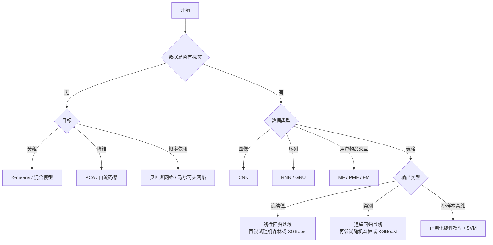

机器学习算法选型不应该从“想使用哪个算法”开始，而应该先回答下面几个问题：

1. 数据是否有标签？
2. 需要预测连续值、类别，还是发现数据中的结构？
3. 数据是表格、图像、序列，还是用户—物品交互数据？
4. 任务更看重预测精度、可解释性、训练速度，还是推理速度？

## 一、先分清不同方法的层次

课程中的概念并不都是相互并列的预测模型，可以把它们分成四层。

| 层次 | 代表方法 | 主要作用 |
| --- | --- | --- |
| 预测模型 | 线性回归、逻辑回归、KNN、SVM、决策树、神经网络 | 学习从输入到输出的映射 |
| 表示学习 | PCA、自编码器、矩阵分解 | 降维、提取特征或学习隐向量 |
| 参数估计与优化 | MLE、MAP、EM、梯度下降、反向传播 | 确定或更新模型参数 |
| 模型组合 | Bagging、Boosting、Stacking | 组合多个基模型以提高泛化能力 |

例如，最大似然估计和梯度下降是用来训练逻辑回归的方法，它们不是与逻辑回归并列的另一种分类模型。

## 二、监督学习算法选型

### 1. 线性回归、岭回归和 LASSO

**线性回归**适合预测连续值，并且输入与输出关系近似线性的任务。它训练快、容易解释，应作为回归任务的基线模型。

- 特征存在明显共线性或希望限制参数大小时，使用 **岭回归（L2）**。
- 特征很多且希望自动进行特征选择时，使用 **LASSO（L1）**。
- 数据存在复杂非线性和强特征交互时，线性模型可能欠拟合。

### 2. 逻辑回归与广义线性模型

**逻辑回归** 适合二分类任务，Softmax 回归可用于多分类。它适合需要概率输出、参数解释和快速推理的场景，应作为分类任务的基线模型。

**广义线性模型（GLM）** 根据输出的分布选择连接函数。例如，标签是事件发生次数时，可以考虑泊松回归。

这类模型的决策边界本质上是线性的，复杂非线性关系需要特征工程或更复杂的模型。

### 3. K 近邻

KNN 适合数据量不大、特征维度不高，并且“相似样本具有相似输出”的分类或回归任务。

- 优点：原理简单，可以形成非线性边界，几乎没有训练开销。
- 限制：预测时需要搜索邻居，数据大时速度慢且占用内存。
- 注意：使用距离前必须缩放特征；高维数据会受到维数灾难的影响。

### 4. 支持向量机

**线性 SVM** 适合中小规模、高维、稀疏的数据，例如文本分类。**核 SVM** 适合数据量不大且分类边界明显非线性的任务，RBF 是常用核函数。

SVM 使用前通常需要标准化特征。当样本数量很大时，核 SVM 的训练和预测代价会明显上升。

### 5. 决策树与集成树模型

| 模型 | 适合场景 | 主要限制 |
| --- | --- | --- |
| 单棵决策树 | 表格数据、非线性阈值和特征交互；需要可视化决策规则 | 容易过拟合，对数据变化敏感 |
| 随机森林 | 表格数据的稳健基线；希望以较少调参降低单棵树的方差 | 模型较大，对超出训练范围的数值外推能力弱 |
| AdaBoost | 弱学习器略优于随机，希望逐轮关注错分样本 | 对错误标签和异常值敏感 |
| GBDT/XGBoost | 结构化表格数据，并且追求较高分类或回归精度 | 超参数较多，需要控制树深、学习率和迭代数 |

ID3、C4.5 和 CART 主要区别在于划分标准和树的结构。实际建模时，更应关注树深、叶节点样本数、剪枝和泛化误差。树模型通常不需要特征标准化。

### 6. Stacking

Stacking 适合已经存在多个预测结果互补的模型，并且数据量足以支持多层训练的情况。

元学习器的训练数据必须来自基学习器的折外预测（out-of-fold prediction）。如果直接使用基模型对其训练集的预测结果，就会发生数据泄漏。

### 7. 推荐模型

- **矩阵分解（MF）**：适合主要依赖用户—物品评分或交互矩阵的协同过滤。
- **概率矩阵分解（PMF）**：对隐向量和评分建立概率模型，可以融入先验与不确定性。
- **因子分解机（FM）**：适合广告点击率、推荐等高维稀疏场景，能学习稀疏特征之间的二阶交互。

MF 难以处理没有历史交互的新用户和新物品，即冷启动问题。FM 可以利用用户和物品的侧信息进行缓解。

### 8. 神经网络

| 模型 | 适合数据 | 选型要点 |
| --- | --- | --- |
| 感知机 | 线性可分的二分类数据 | 主要用于理解线性分类和神经网络基础 |
| MLP | 数量较大、关系复杂的向量数据 | 需要缩放输入，调节网络容量并使用正则化 |
| CNN | 图像、网格和具有局部空间结构的数据 | 小数据集上宜优先使用数据增强和迁移学习 |
| RNN/GRU | 时间序列、文本等顺序信息重要的数据 | GRU 通过门控机制缓解普通 RNN 的长期依赖问题 |

LeNet-5、AlexNet 和 VGG 都是 CNN 的具体网络结构，不是与 CNN 并列的算法类别。

## 三、无监督学习算法选型

| 方法 | 适合场景 | 注意事项 |
| --- | --- | --- |
| K-means | 客户分群、样本分组；簇近似球形且大小接近 | 需要缩放特征和指定 $K$；对异常值敏感 |
| K-means++ | 与 K-means 相同 | 改善初始中心的选择，通常应作为默认初始化方式 |
| PCA | 线性降维、去相关、降噪、可视化或模型预处理 | 只能表达线性结构；应只在训练集上拟合 |
| 自编码器 | 图像等高维数据的非线性降维、特征学习、重建或异常检测 | 需要比 PCA 更多的数据和调参 |
| 贝叶斯网络 | 依赖方向比较明确，希望表达条件概率并进行概率推断 | 图中的有向边不会自动证明因果关系 |
| 马尔可夫网络 | 变量之间存在无方向的局部相互依赖 | 复杂网络的推断和配分函数计算可能很昂贵 |
| EM | 混合模型、隐类别或其他存在不可见隐变量的模型 | EM 是参数估计算法，可能陷入局部最优且依赖初始化 |

无监督学习不能保证自动发现业务上有意义的类别。除了轮廓系数等内部指标，还要检查分组的稳定性、可解释性和对后续任务的价值。

## 四、快速选型路线

对常见表格任务，可以使用下面的简单路线：

- 表格回归：均值基线 → 线性回归 → 随机森林 → GBDT/XGBoost。
- 表格分类：多数类基线 → 逻辑回归 → 随机森林 → GBDT/XGBoost。
- 中小样本、高维数据：优先尝试正则化线性模型或 SVM。

如果复杂模型相对简单基线的改善很小，应优先选择更容易解释、部署和维护的模型。

## 五、完整的机器学习流程

### 1. 定义问题

先把业务问题翻译成可计算的任务：

- 一个样本代表什么？
- 在什么时间点作预测？
- 标签如何定义，预测需要提前多久？
- 错报和漏报分别有什么代价？
- 模型的延迟、内存、可解释性和更新频率限制是什么？

应该从“要解决什么问题”开始，而不是从“要使用 XGBoost”开始。

### 2. 定义评价指标和基线

| 任务 | 常用指标 | 选择方法 |
| --- | --- | --- |
| 回归 | MAE、RMSE、$R^2$ | MAE 更容易解释且对异常值较稳健；RMSE 更惩罚大误差 |
| 均衡分类 | Accuracy | 各类代价和样本量接近时使用 |
| 不均衡分类 | Precision、Recall、F1、PR-AUC | 少数类特别少时，不能只看 Accuracy |
| 排序能力 | ROC-AUC | 衡量多个阈值下的整体排序能力 |
| 概率质量 | Log Loss、Brier Score、校准曲线 | 当预测概率本身要参与决策时使用 |
| 聚类 | 轮廓系数、稳定性、业务可解释性 | 内部指标只能辅助判断，不能代替业务验证 |

基线可以是预测均值、众数或简单规则，同时应训练一个线性回归或逻辑回归作为学习模型基线。

### 3. 收集并审计数据

检查数据量、特征类型、缺失值、重复数据、异常值、错误标签和类别不平衡。还要确认训练数据与真实使用场景一致，并排查预测时无法获得的信息。

### 4. 先划分数据，再做预处理

- 独立同分布数据可以随机划分训练集、验证集和测试集。
- 分类任务通常使用分层划分，保持各类别比例。
- 时间序列应按时间先后划分，不能随机打乱未来数据。
- 同一用户、设备或对象有多条记录时，应按对象分组划分。
- 测试集只用于最终评估，不参与特征选择和调参。

缺失值填充、均值方差、类别编码、PCA 主成分以及特征选择规则，都只能在训练数据上拟合，然后再应用于验证集和测试集。

### 5. 探索数据并构建特征

- 数值特征：填充缺失值，根据分布考虑对数变换或异常值处理。
- 分类特征：使用独热编码或其他与模型匹配的编码。
- 时间特征：提取小时、星期、季节、时间间隔和滞后特征。
- 图像：只对训练集进行随机数据增强，验证和测试使用确定性预处理。

KNN、SVM、线性模型、神经网络、K-means 和 PCA 通常需要特征缩放，决策树、随机森林和 XGBoost 通常不依赖缩放。

### 6. 训练基线与候选模型

先让数据处理、训练、预测和评估流程完整跑通，再逐步增加模型复杂度。候选模型应来自不同假设，而不是只调节同一个模型的大量参数。

### 7. 交叉验证与超参数调整

数据较少时，在训练集内使用交叉验证选择超参数。时间数据应使用保留时序的滚动或扩展窗口验证。

调参过程中不能查看测试集并据此修改模型，否则测试集就实际上变成了验证集。

### 8. 误差分析与阈值选择

不能只看一个总体分数，还应检查：

- 哪些类别、用户群和时间段表现较差；
- 混淆矩阵中哪些类别经常混淆；
- 问题是否来自缺失数据、异常值或错误标签；
- 训练误差和验证误差的差距；
- 改变分类阈值后 Precision 和 Recall 如何变化。

训练和验证表现都差通常表示欠拟合；训练表现很好但验证明显变差通常表示过拟合。

分类模型的概率输出不等于最终决策。应根据错报和漏报的业务代价选择阈值，并在必要时检查概率校准。

### 9. 最终评估与定版

模型结构、特征、超参数和阈值全部确定后：

1. 在完整训练数据上重新训练。
2. 对从未参与开发的测试集评估一次。
3. 报告指标、基线对比、分组结果和必要的置信区间。
4. 保存模型、预处理器、特征顺序、训练配置和数据版本。

### 10. 部署与监控

线上预处理必须与训练时完全一致，并处理输入校验、缺失字段、未知类别、模型版本和回滚。

上线后持续监控：

- 输入特征的分布漂移；
- 标签比例和真实预测效果的变化；
- 缺失率、未知类别和数据质量；
- 推理延迟、错误率和资源消耗；
- 概率校准、分组表现和业务收益；
- 何时触发重新训练。

## 六、总结

完整的机器学习流程可以概括为：

> 定义问题与代价 → 构造可靠标签 → 正确划分数据 → 防止泄漏地预处理 → 建立基线 → 交叉验证选模型 → 误差分析与定阈值 → 一次性最终测试 → 部署 → 监控和重训。

算法选型的核心不是寻找一个始终最好的模型，而是根据任务、数据和工程约束建立合理的候选集，然后通过可靠的验证流程做出选择。
