[官方教程](https://mermaid.nodejs.cn/intro/)

**Mermaid 是什么?**

Mermaid 是一种用文本描述图表的语法。你写代码，它就渲染成流程图、时序图、甘特图等。

**最小示例**

源码：

```text
graph TD
    A[开始] --> B{判断}
    B -->|是| C[执行]
    B -->|否| D[结束]
```

效果：

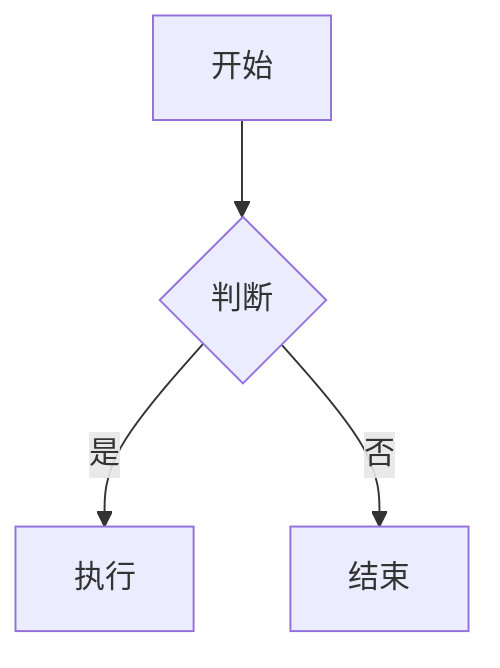

## 1. 流程图 Flowchart

### 方向

- `TB` / `TD`: 从上到下
- `BT`: 从下到上
- `LR`: 从左到右
- `RL`: 从右到左

源码：

```text
flowchart LR
    A --> B --> C
```

效果：

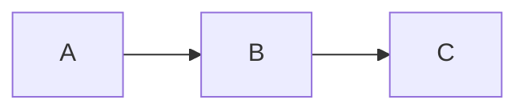

### 常用节点形状

源码：

```text
flowchart TB
    A[矩形]
    B(圆角)
    C((圆形))
    D{菱形判断}
    E[(数据库)]
    F>旗帜]
```

效果：

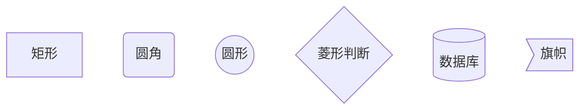

### 连线

- `-->` 普通箭头
- `---` 无箭头
- `-.->` 虚线箭头
- `==>` 粗箭头
- `-- 文本 -->` 带标签

源码：

```text
flowchart LR
    A -- 文本 --> B
    B -. 虚线 .-> C
    C ==> D
```

效果：

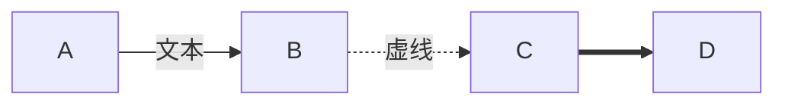

### 子图 subgraph

源码：

```text
flowchart TB
    subgraph 前端
      A[Vue]
      B[React]
    end

    subgraph 后端
      C[Go]
      D[Node]
    end

    A --> C
    B --> D
```

效果：

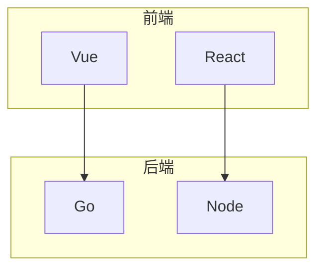

## 2. 时序图 Sequence Diagram

源码：

```text
sequenceDiagram
    participant U as 用户
    participant W as Web
    participant S as 服务

    U->>W: 发起请求
    W->>S: 调用接口
    S-->>W: 返回数据
    W-->>U: 渲染页面
```

效果：

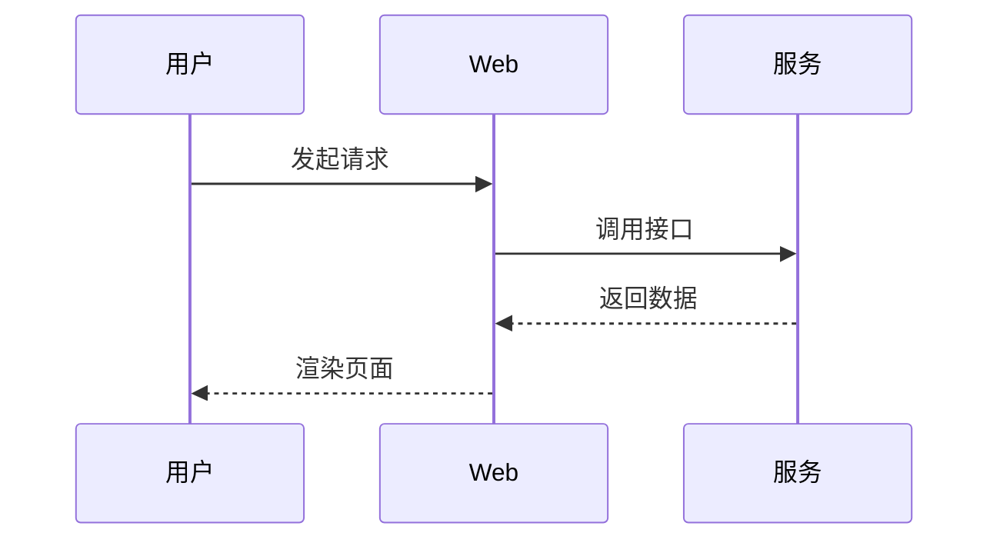

常用语法:

- `participant` 定义参与者
- `->>` 实线消息
- `-->>` 虚线消息（常表示返回）
- `Note right of A: ...` 备注
- `alt / else / end` 分支
- `loop / end` 循环

## 3. 类图 Class Diagram

源码：

```text
classDiagram
    class Animal {
      +String name
      +eat()
    }

    class Dog {
      +bark()
    }

    Animal <|-- Dog
```

效果：

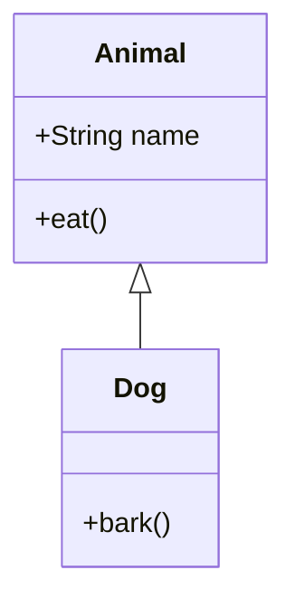

常见关系:

- `<|--` 继承
- `*--` 组合
- `o--` 聚合
- `-->` 关联
- `..>` 依赖

## 4. 状态图 State Diagram

源码：

```text
stateDiagram-v2
    [*] --> 待机
    待机 --> 运行: start
    运行 --> 暂停: pause
    暂停 --> 运行: resume
    运行 --> [*]: stop
```

效果：

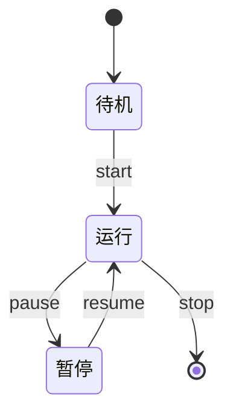

## 5. 甘特图 Gantt

源码：

```text
gantt
    title 项目计划
    dateFormat  YYYY-MM-DD

    section 需求
    需求分析 :a1, 2026-05-13, 3d

    section 开发
    编码实现 :a2, after a1, 5d
    联调测试 :a3, after a2, 2d
```

效果：


## 6. 饼图 Pie

源码：

```text
pie showData
    title 学习时间分配
    "Mermaid" : 4
    "Linux" : 3
    "数学" : 3
```

效果：

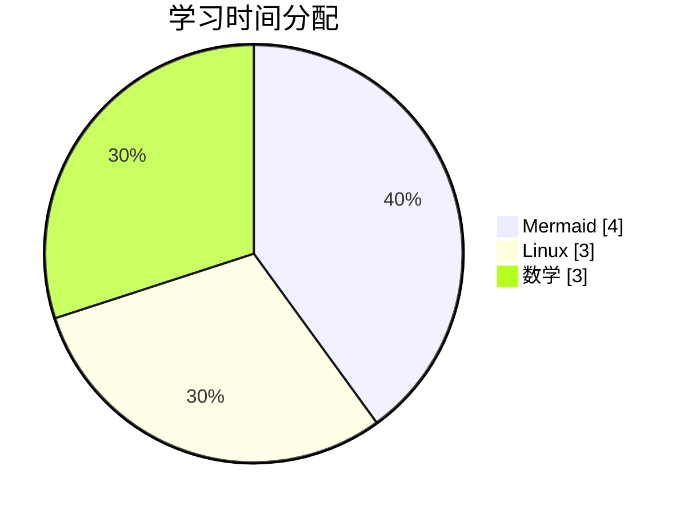

## 7. Git 图 GitGraph

源码：

```text
gitGraph
    commit
    branch feature
    checkout feature
    commit
    checkout main
    merge feature
```

效果：

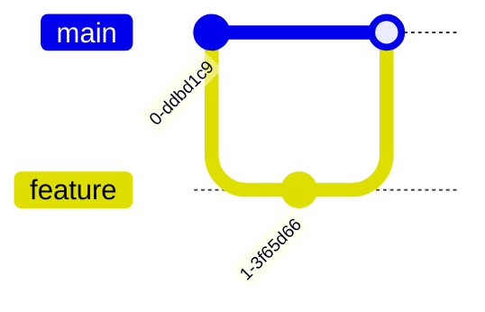

## 8. ER 图（实体关系图）

源码：

```text
erDiagram
    USER ||--o{ ORDER : places
    ORDER ||--|{ ORDER_ITEM : contains
    USER {
      int id
      string name
    }
    ORDER {
      int id
      date created_at
    }
```

效果：

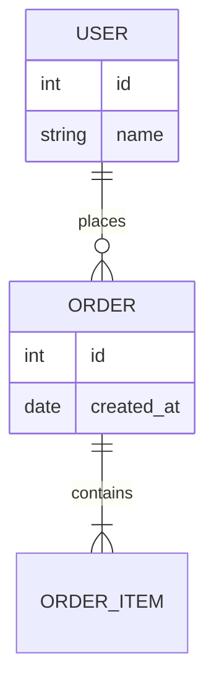

## 9. 样式与主题

### 给节点加 class

源码：

```text
flowchart LR
    A[API] --> B[Service]
    classDef hot fill:#ffefef,stroke:#ff4d4f,stroke-width:2px;
    class A hot;
```

效果：

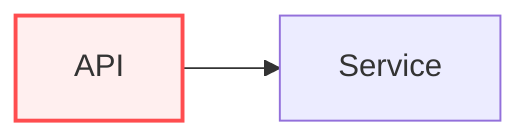

### linkStyle 调整连线

源码：

```text
flowchart LR
    A --> B
    B --> C
    linkStyle 1 stroke:#f66,stroke-width:3px;
```

效果：

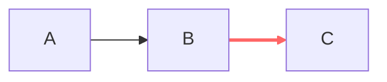

## 10. 常见坑

- 节点 ID 不要带空格，显示文本可放在 `[]` 里。
- 中文和特殊符号多时，建议把标签放引号中（某些图类型更稳）。
- `subgraph`、`alt`、`loop` 等结构都要记得 `end`。
- 站点需要启用 Mermaid 渲染（你这个博客里已经开了 `mermaid: true`）。

**速记模板**

源码：

```text
flowchart TB
    Start([Start]) --> Input[/Input/]
    Input --> Judge{OK?}
    Judge -->|Yes| Done([Done])
    Judge -->|No| Retry[Retry]
    Retry --> Input
```

效果：

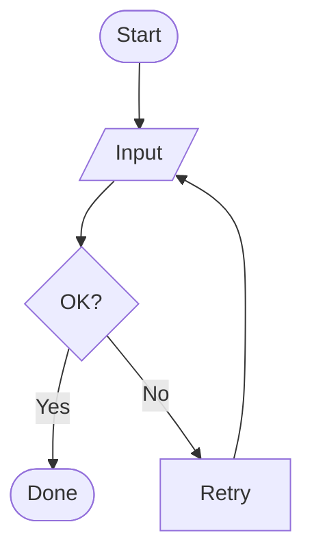

## 11. 文本封装（双引号与反引号）

在 Mermaid 里，节点文字如果包含空格、标点、Markdown 样式，推荐用双引号包起来；如果要显示“代码风格”或 Markdown 格式，可以在双引号里再用反引号。

1. 双引号：`"文本"`
2. 双引号 + 反引号：`"`文本`"`

源码：

```text
flowchart TB
    A["普通文本：支持空格和标点，比较稳"]
    B["`行内代码风格`"]
    C["**加粗** 和 *斜体*"]
    D["包含特殊符号：()[]{}<>"]
    A --> B --> C --> D
```

效果：

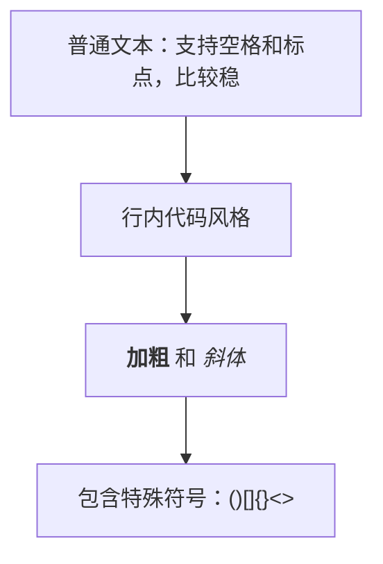

提示：如果你只是普通短文本，不一定非要加引号；但为了减少转义和解析问题，复杂文本统一写成 `"..."` 会更稳。
