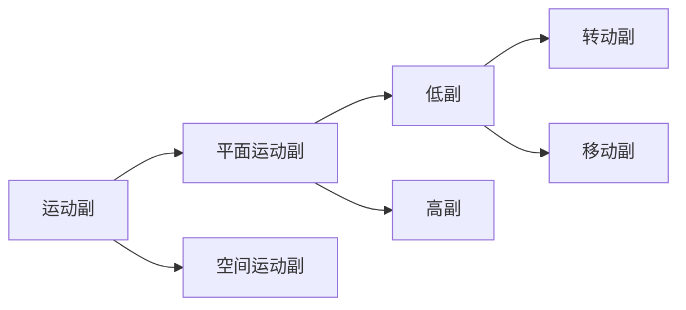

## 2-1 机构分析的基本内容

**零件和构件的区别？**

> **零件：**机械制造的最小单元  
> **构件：**运动的最小单元，可以由一个或多个零件组成

**完整机械系统的四个组成部分？**

> 原动机、传动机构、执行机构和控制系统

**机构的定义？**

> 机构是一个具有相对机械运动的构件系统，或是用来传递与变换运动和动力的可动装置

> 机械包括机构和机器，一部机器包含一个或若干个机构
{: .prompt-info }

## 2-2 机构的组成及其运动简图的绘制

### 一、机构的组成要素

#### 1.构件和运动副

机构是由**构件**和**运动副**两个要素组成的

>**构件：**一个整体运动的刚体单元  
>**运动副：**两构件直接接触而又能产生一定相对运动的活动连接  
>**运动副元素：**两构件上参与接触而构成运动副的部分

#### 2.运动链

**运动链** 若干个构件通过运动副连接而成的构件系统。首尾封闭的称为**闭式链**，否则为**开式链**

#### 3.机构

将运动链中的一个构件固定作为参考坐标系，则这种运动链称为**机构**。
作为参考坐标系的构件称为**机架**。
按给定规律运动的构件称为**主动件（原动件）**，随主动件运动的构件称为**从动件**

### 二、运动副的分类

#### 1.根据运动副引入的约束数

把引入1个约束的运动副称为Ⅰ级副,引入2个约束的运动副称为Ⅱ级副，最末为Ⅴ级副

#### 2.根据构成运动副的两构件的接触情况

以**面**接触的运动副称为**低副**，以**点或线**接触的运动副称为**高副**

#### 3.根据构成运动副的两构件间的相对运动形式

### 三、机构运动简图

**机构运动简图和机构示意图的区别？**

>**机构运动简图：**按一定比例定出各运动副的位置，并只用代表构件的线条和规定的运动副符号绘制出表示机构机构和运动特征的简单图形  
>**机构示意图：**不按比例绘制的运动简图

## 2-3 机构自由度的计算

### 一、平面机构自由度及其计算公式

$$
F=3n-2P_L-P_H
(n为活动构件数，P_L为低副数，P_H为高副数)
$$

>$n$是活动构件数，不包含机架
{: .prompt-warning }

### 二、机构自由度的意义以及具有确定运动的条件

1. 机构的自由度$F$不能小于或等于零
2. 若$F>0$,而且主动件数$<F$,则机构能动，但构件间运动不确定
3. 若$F>0$,而且主动件数$>F$,则构件间不能实现确定的相对运动或产生破坏
4. 若$F>0$,而且主动件数$=F$,则构件间的相对运动是确定的

>**机构具有确定运动的条件：**机构的自由度大于零且主动件数等于机构的自由度数
{: .prompt-info }

### 三、计算机构自由度时的注意事项

#### 1.复合铰链

由$m$个构件汇聚而成的复合铰链包含$m-1$个转动副

#### 2.局部自由度

不影响整个机构运动的自由度称为**局部自由度**

>其实基本只需要考虑滚子
{: .prompt-info }

#### 3.虚约束

起重复限制作用的约束称为**虚约束**

1. 移动副导路平行
2. 转动副轴线重合
3. 两构件上距离始终不变的两点使用一个杆件连接
4. 两构件上的轨迹相同的两个点使用转动副连接
5. 对称结构

>其实我觉得3和4两种情况本质上是一样的，3中的杆件长度为0的时候就退化成一个转动副了
{: .prompt-tip }

>$F = 3n - 2P_L - P_H + P'$,所以最后有几个独立的虚约束就在结果里补偿几个自由度
{: .prompt-info }

## 2-4 平面机构的组成原理和结构分析

### 一、平面机构的组成原理

任何机构都包含**机架**、**主动件**和**从动件系统**三部分

最简单的、不可再分的、自由度为零的构件杆组称为**基本杆组**或**阿苏尔杆组**，机构中所包含的基本杆组的最高级数作为**机构的级数**

**机构的组成原理：**任何机构都可以看作由若干基本杆组依次连接于主动件和机架上所形成的系统

### 二、平面机构的运动分析

1. 去除虚约束和局部自由度，计算机构的自由度并确定主动件
2. 拆杆组，从远离主动件的构件开始拆分
3. 确定机构的级别

### 三、平面机构的高副低代

高副低代的条件：
 1.代替前后机构的自由度完全相同
 2.代替前后机构的瞬时运动状况不变

>一般是找两个曲率中心，然后用一个构件和两个运动副连接起来。如果轮廓之一为直线的话就退化成移动副
{: .prompt-info }
>对于一般的高副机构只能进行瞬时替代
{: .prompt-info }
